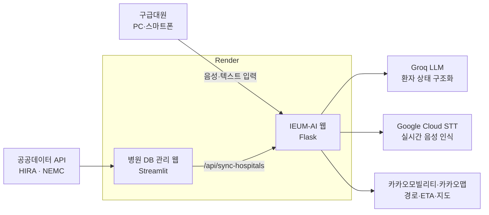

# IEUM-AI · 응급환자 이송 병원 추천 시스템

> 구급대원이 말로 환자 상태를 입력하면, AI가 필요한 의료자원을 분석하고 전국 병원의 실시간 수용 정보와 실제 도로 이송시간을 함께 고려해 최적의 병원을 추천합니다.

'응급실 뺑뺑이'처럼 병원 선정이 늦어져 골든타임을 놓치는 문제를 줄이기 위한 **AI 기반 응급의료 매칭 시스템 프로토타입**입니다.

| 서비스 | 주소 | 역할 |
| --- | --- | --- |
| IEUM-AI 웹 (Flask) | https://ieum-ai-project.onrender.com | 환자 분석 · 병원 추천 · 경로 안내 |
| 병원 DB 관리 웹 (Streamlit) | https://db-manager-ieum-ai.onrender.com | 병원 DB 조회 · 실시간 갱신 · IEUM-AI 동기화 |

> Render 무료 플랜을 사용하므로 한동안 접속이 없으면 서버가 절전 상태가 되어, 첫 접속에 1분 정도 걸릴 수 있습니다.

---

## 주요 기능

**IEUM-AI 웹**
- 🎙 **실시간 음성 입력**: Google Cloud Speech-to-Text 스트리밍 인식과 의료 자연어 후처리를 거칩니다(예: "혈압 백삼십에 팔십" → "혈압 130/80", "산소포화도 95퍼센트" → "SpO2 95%").
- 🧠 **AI 환자 상태 분석**: Groq LLM(`openai/gpt-oss-120b`)이 환자 설명을 구조화된 요구조건으로 변환합니다. 결과에는 KTAS, 골든타임, 필수 진료과·장비, ICU·수술실 필요 여부가 담깁니다.
- 🏥 **병원 수용 가능 여부 판별(Hard Filter)**: 필수 조건을 명확히 충족하지 못하는 병원은 제외합니다. 정보가 없어 판단할 수 없는 병원은 '확인 필요' 후보로 남깁니다.
- 🧮 **추천 알고리즘 4종**: Model A(최근접), B(MILP), C(TOPSIS), D(가중치 종합점수)를 제공하며, 모델을 바꾸면 즉시 다시 계산합니다.
- 🗺 **카카오 도로 경로 기반 ETA**와 골든타임 우선 배치를 적용합니다.
- 📍 **환자 위치**: 기기 GPS를 사용하거나, 시연용으로 전국 병원 주변 0.8~5km 지점에 랜덤으로 생성합니다.
- 📞 병원 전화 연결, 사전 수용 신청 기록, **내비게이션 시뮬레이션**(실제 도로 좌표와 교통 상태를 반영하며 X1~X10 배속)을 지원합니다.
- 📊 **모델 성능 검증 패널**: 수용성공률, 골든타임 준수율, 평균·P95 ETA, 혼잡도, 계산시간을 보여줍니다.
- 📱 **반응형 웹**으로 PC와 스마트폰 브라우저에서 모두 사용할 수 있습니다.

**병원 DB 관리 웹**
- 전국 상급종합·종합병원 **384곳** DB를 시·도, API 매칭 상태, 진료과 유무, 병원명으로 조회합니다.
- NEMC 실시간 응급자원(병상·장비)과 HIRA 상세정보(진료과·전문의·특수진료·장비)를 갱신합니다.
- 갱신한 DB를 IEUM-AI 메모리로 즉시 동기화하고, 수행 로그를 보여줍니다.

---

## 시스템 구성



### 추천 흐름
1. **환자 입력**: 텍스트 또는 음성(STT → 의료 용어 후처리)
2. **위치 결정**: GPS / 랜덤 생성 / 기본 위치(대전광역시청)
3. **환자 구조화**: Groq → `PatientInfo`(같은 문장은 캐시 재사용)
4. **Hard Filter**: 필수 조건을 병원 DB와 비교
5. **경로 계산**: 카카오 다중 목적지 API(최대 30개 × 2회). 경로를 받지 못한 병원은 직선거리 기반 근사값을 씁니다.
6. **순위 계산**: 선택한 모델(A~D)로 순위를 매기고, 골든타임 안에 도착 가능한 병원을 앞에 둡니다. 상위 10개를 표시합니다.
7. **병원 선택**: 카카오 단일 경로로 미리보기
8. **이송 시작**: `dispatch_log.jsonl`에 기록하고 내비게이션 시뮬레이션을 시작합니다.

---

## 폴더 구조

```
├── ai_server.py                      # IEUM-AI Flask 백엔드 (환자 분석·추천·STT·경로 API)
├── server.ai.html                    # IEUM-AI 프론트엔드 (단일 페이지)
├── js/
│   ├── voiceInput.js                 # 마이크 → WebSocket → Google STT 실시간 음성 입력
│   ├── medicalTextNormalizer.js      # 의료 자연어 보수적 후처리
│   └── trafficSimulation.js          # 카카오 경로 기반 내비게이션 시뮬레이션
├── css/
│   └── kakao_navigation.css          # 내비게이션 화면 스타일
├── app.py                            # 병원 DB 관리 웹 (Streamlit)
├── api_client.py                     # NEMC 응급의료기관 API 클라이언트
├── build_national_master_db.py       # ① HIRA 병원 목록 → 마스터 DB 생성
├── update_realtime_resources_national.py  # ② NEMC 실시간 자원 매칭
├── update_departments_hira_api.py    # ③ HIRA 진료과·전문의·특수진료·장비 보완
├── national_hospital_master.xlsx                     # ① 결과
├── national_hospital_db_realtime_updated.xlsx        # ② 결과
├── national_hospital_db_departments_hira_updated.xlsx  # ③ 결과 (최종 DB)
├── saver_current_hospital_db.xlsx    # IEUM-AI 기본 DB(fallback)
├── dispatch_log.jsonl                # 병원 사전 수용 신청 기록
├── requirements.txt
└── runtime.txt
```

IEUM-AI는 병원 DB를 다음 순서로 찾아 사용합니다: **DB 관리 웹에서 동기화한 메모리 DB → `saver_current_hospital_db.xlsx` → HIRA 갱신본 → 실시간 갱신본 → 마스터 DB**

---

## 기술 스택

| 구분 | 기술 |
| --- | --- |
| 백엔드 | Python 3, Flask, Flask-CORS, Flask-Sock |
| DB 관리 웹 | Streamlit, streamlit-autorefresh |
| 데이터 처리 | pandas, NumPy, openpyxl |
| 최적화·검증 | PuLP 3.3.2 (MILP), Pydantic |
| 프론트엔드 | HTML, JavaScript, Tailwind CSS, Web Audio API |
| AI·음성 | Groq API (`openai/gpt-oss-120b`), Google Cloud Speech-to-Text V2 (`chirp_3`) |
| 지도·경로 | 카카오맵 JavaScript SDK, 카카오모빌리티 길찾기 API |
| 공공데이터 | HIRA 병원정보서비스, HIRA 의료기관별상세정보서비스, NEMC 응급의료기관 정보 조회 서비스 |
| 배포 | GitHub, Render |

---

## 실행 방법

### 1. 설치
```bash
git clone https://github.com/jhnxk/SAVER-AI.git
cd SAVER-AI
pip install -r requirements.txt
```

### 2. 환경변수 (`.env`)

| 변수 | 사용처 | 설명 |
| --- | --- | --- |
| `GROQ_API_KEY` | IEUM-AI | Groq API 키 (필수) |
| `GROQ_MODEL` | IEUM-AI | 기본값 `openai/gpt-oss-120b` |
| `KAKAO_REST_API_KEY` | IEUM-AI | 카카오모빌리티 길찾기 REST 키 |
| `KAKAO_JAVASCRIPT_KEY` | IEUM-AI | 카카오맵 JavaScript 키 |
| `GOOGLE_CLOUD_PROJECT` | IEUM-AI | Google Cloud 프로젝트 ID (없으면 ADC에서 자동 탐지) |
| `GOOGLE_APPLICATION_CREDENTIALS` | IEUM-AI | 서비스 계정 키 파일 경로 (배포 환경에서 STT 사용 시) |
| `DB_MANAGER_URL` | IEUM-AI | DB 관리 웹 주소 (기본 `http://localhost:8501`) |
| `SERVICE_KEY` | DB 관리 웹 | NEMC 응급의료기관 API 인증키 |
| `HIRA_SERVICE_KEY` | DB 관리 웹 | HIRA 병원정보서비스 인증키 |
| `HIRA_DETAIL_SERVICE_KEY` | DB 관리 웹 | HIRA 의료기관별상세정보서비스 인증키 |
| `SAVER_URL` | DB 관리 웹 | IEUM-AI 주소 (기본 `http://127.0.0.1:5050`) |
| `AUTO_REFRESH_ON_START` | DB 관리 웹 | 첫 접속 시 실시간 자동 갱신 여부 (기본 `1`, Render에서는 `0` 권장) |
| `DEPARTMENT_UPDATE_LIMIT` | DB 관리 웹 | HIRA 상세정보 갱신 병원 수 (`0` = 전체) |
| `TZ` | 공통 | 배포 서버 시간대. `Asia/Seoul`로 설정 |

> API 키는 저장소에 올리지 말고 `.env`나 Render 환경변수로만 관리하세요.

### 3. 병원 DB 구축 (처음 한 번)
```bash
python build_national_master_db.py                          # 마스터 DB
python update_realtime_resources_national.py                # 실시간 자원 매칭
DEPARTMENT_UPDATE_LIMIT=0 python update_departments_hira_api.py   # HIRA 상세정보
```
저장소에는 이미 생성된 DB 파일이 들어 있으므로, 바로 실행만 하려면 이 단계는 건너뛰어도 됩니다.

### 4. 실행
```bash
# 터미널 1 — IEUM-AI (http://localhost:5050)
python ai_server.py

# 터미널 2 — 병원 DB 관리 웹 (http://localhost:8501)
streamlit run app.py
```

### Render 배포 (예시)
| 서비스 | Start Command | 주요 환경변수 |
| --- | --- | --- |
| IEUM-AI | `python ai_server.py` | `GROQ_API_KEY`, `KAKAO_*`, `DB_MANAGER_URL`, `TZ=Asia/Seoul` |
| DB 관리 웹 | `streamlit run app.py --server.port $PORT --server.address 0.0.0.0` | `SERVICE_KEY`, `HIRA_*`, `SAVER_URL`, `AUTO_REFRESH_ON_START=0`, `TZ=Asia/Seoul` |

---

## 실험 결과 요약

| 실험 | 규모 | 결과 |
| --- | --- | --- |
| 음성 인식 | 4명 × 15문장 = 60건 | 핵심정보 보존율 **93.3%**, 의료용어 정확도 97.4%, 말더듬 처리 100% |
| 모델 비교 | 8개 시나리오 × 5개 위치 × 4개 모델 = 160건 | Model B: 필수조건 충족률 **100%**, 1위 병원 평균 ETA 13.8분 |
| End-to-End | 20건 (모바일 12, PC 8) | 성공률 **100%**, 평균 소요 34.4초 |

모델 비교에서 **Model B(MILP)** 가 필수조건 충족률 100%를 유지했습니다. 최근접 모델(A)보다 평균 2.1분 늦을 뿐이어서, 사전에 정한 평가 기준에서 가장 균형 잡힌 모델로 최종 선정했습니다.

---

## 한계와 개선 방향

- **ETA 근사값**: 카카오 다중 목적지 조회에서 경로를 받지 못한 병원은 직선거리 기반 근사값을 사용하므로, 병원 선택 후의 실제 경로값과 차이가 날 수 있습니다. 무료 API 호출 한도 때문에, 추천 상위 병원만 단일 경로로 재확인하는 방식을 검토하고 있습니다.
- **무료 인프라**: Render 무료 플랜에는 절전 모드와 512MB 메모리 제한이 있고, 무료 API에는 호출 한도가 있습니다.
- **병원 연계**: 사전 수용 신청은 아직 실제 병원 시스템과 연동되지 않았고, 전송 기록(`dispatch_log.jsonl`)으로만 남습니다.
- **진료과 데이터**: HIRA 진료과목에 '심장내과'와 '신생아과'가 따로 구분되어 있지 않습니다.

> 본 프로젝트는 실험용 프로토타입이며, 실제 응급 상황의 의료적 판단을 대신하지 않습니다.
